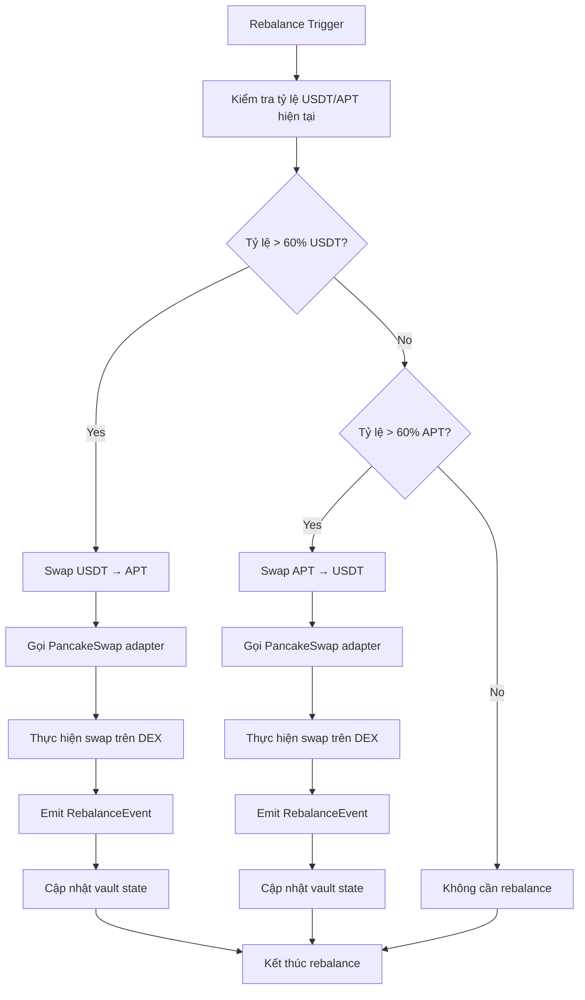

# 🏦 Aptos Vault - DeFi Investment Platform

## 📋 Tổng quan dự án

Aptos Vault là một nền tảng DeFi cho phép người dùng đầu tư USDT vào một vault thông minh, tự động rebalance giữa USDT và APT token thông qua PancakeSwap để tối ưu hóa lợi nhuận.

### 🎯 Mục tiêu chính
- Cung cấp giải pháp đầu tư DeFi đơn giản và hiệu quả
- Tự động rebalance portfolio để tối ưu lợi nhuận
- Tích hợp LayerZero để cross-chain bridge USDT
- Giao diện thân thiện với người dùng

---

## 🏗️ Kiến trúc hệ thống

### 📊 Sơ đồ kiến trúc tổng thể

```
┌─────────────────┐    ┌─────────────────┐    ┌─────────────────┐
│   Frontend UI   │    │   Backend API   │    │  Aptos Vault    │
│   (Svelte)      │◄──►│   (Python)      │◄──►│   (Move)        │
└─────────────────┘    └─────────────────┘    └─────────────────┘
         │                       │                       │
         │                       │                       │
         ▼                       ▼                       ▼
┌─────────────────┐    ┌─────────────────┐    ┌─────────────────┐
│  Pontem Wallet  │    │   LayerZero     │    │  PancakeSwap    │
│   (Aptos)       │    │   (Bridge)      │    │   (DEX)         │
└─────────────────┘    └─────────────────┘    └─────────────────┘
```

### 🔧 Các thành phần chính

1. **Frontend (Svelte)**
   - Giao diện người dùng
   - Kết nối ví Pontem
   - Hiển thị thông tin vault
   - Thực hiện giao dịch

2. **Backend API (Python)**
   - Xử lý logic nghiệp vụ
   - Tương tác với smart contract
   - Quản lý dữ liệu người dùng

3. **Smart Contracts (Move)**
   - Vault contract: Quản lý deposit/withdraw
   - PancakeSwap adapter: Thực hiện swap
   - Vault core: Quản lý shares và rebalancing

4. **LayerZero Integration**
   - Bridge USDT từ Ethereum/Polygon sang Aptos
   - Cross-chain liquidity management

---

## 🔄 Luồng người dùng chi tiết

### 📈 Bản vẽ luồng đầu tư

```mermaid
graph TD
    A[User truy cập website] --> B[Connect Pontem Wallet]
    B --> C{Wallet connected?}
    C -->|No| D[Hiển thị hướng dẫn cài đặt Pontem]
    C -->|Yes| E[Hiển thị dashboard]
    
    E --> F[User chọn "Deposit USDT"]
    F --> G[Kiểm tra USDT balance]
    G --> H{USDT trên Aptos?}
    
    H -->|No| I[LayerZero Bridge Process]
    I --> I1[User approve USDT trên Ethereum/Polygon]
    I1 --> I2[LayerZero bridge USDT sang Aptos]
    I2 --> I3[Chờ confirmation (5-10 phút)]
    I3 --> J[USDT đã có trên Aptos]
    
    H -->|Yes| J
    
    J --> K[User nhập số lượng USDT muốn deposit]
    K --> L[Hiển thị preview: shares sẽ nhận]
    L --> M[User confirm deposit]
    M --> N[Smart contract thực hiện deposit]
    N --> O[Vault mint shares cho user]
    O --> P[Emit DepositEvent]
    P --> Q[Cập nhật UI: shares balance]
    
    Q --> R[Vault tự động rebalance?]
    R -->|Yes| S[Trigger rebalance logic]
    S --> S1[Kiểm tra tỷ lệ USDT/APT hiện tại]
    S1 --> S2[Thực hiện swap trên PancakeSwap]
    S2 --> S3[Emit RebalanceEvent]
    S3 --> T[Vault đã được rebalance]
    
    R -->|No| T
    
    T --> U[User có thể: Withdraw hoặc Deposit thêm]
    U --> V[User chọn "Withdraw"]
    V --> W[User nhập số shares muốn withdraw]
    W --> X[Hiển thị preview: USDT sẽ nhận]
    X --> Y[User confirm withdraw]
    Y --> Z[Smart contract burn shares]
    Z --> AA[Vault trả USDT cho user]
    AA --> BB[Emit WithdrawEvent]
    BB --> CC[Cập nhật UI: USDT balance]
```

### 🔄 Luồng Rebalancing



---

## 💰 Tính năng chi tiết

### 🏦 Vault Management

#### Deposit Process
1. **User Input**: Nhập số lượng USDT muốn deposit
2. **Validation**: Kiểm tra balance và allowance
3. **Share Calculation**: Tính toán shares dựa trên current ratio
4. **Transaction**: Thực hiện deposit transaction
5. **Event Emission**: Emit DepositEvent với thông tin chi tiết

#### Withdraw Process
1. **User Input**: Nhập số shares muốn withdraw
2. **Validation**: Kiểm tra shares balance
3. **USDT Calculation**: Tính toán USDT sẽ nhận
4. **Transaction**: Thực hiện withdraw transaction
5. **Event Emission**: Emit WithdrawEvent

#### Rebalancing Logic
- **Target Ratio**: 50% USDT / 50% APT
- **Rebalance Threshold**: ±10% deviation
- **Execution**: Tự động hoặc manual trigger
- **Gas Optimization**: Batch transactions

### 🔗 LayerZero Integration

#### Cross-chain Bridge
1. **Source Chain**: Ethereum/Polygon
2. **Destination Chain**: Aptos
3. **Asset**: USDT (LayerZero wrapped)
4. **Bridge Time**: 5-10 phút
5. **Security**: LayerZero's secure messaging

#### Bridge Process
```
Ethereum/Polygon USDT → LayerZero Bridge → Aptos USDT
```

### 🥞 PancakeSwap Integration

#### Swap Functions
- `swap_apt_for_usdt(amount)`: Swap APT → USDT
- `swap_usdt_for_apt(amount)`: Swap USDT → APT
- `get_quote(input_token, output_token, amount)`: Get swap quote

#### Router Management
- **Router Address**: `0xc7efb4076dbe143cbcd98cfaaa929ecfc8f299405d018d7e18f75ac2b0e95f60`
- **Path Finding**: Automatic optimal path detection
- **Slippage Protection**: Configurable slippage tolerance

---

## 📊 Data Models

### VaultResource
```move
struct VaultResource {
    total_shares: u64,
    total_usdt: u64,
    total_apt: u64,
    owner: address,
    created_at: u64
}
```

### UserShares
```move
struct UserShares {
    shares: u64,
    last_deposit: u64,
    last_withdraw: u64
}
```

### Events
```move
struct DepositEvent {
    user: address,
    amount: u64,
    shares_minted: u64,
    timestamp: u64
}

struct WithdrawEvent {
    user: address,
    amount: u64,
    shares_burned: u64,
    timestamp: u64
}

struct RebalanceEvent {
    usdt_amount: u64,
    apt_amount: u64,
    timestamp: u64
}
```

---

## 🔐 Security Features

### Smart Contract Security
- **Access Control**: Owner-only functions
- **Reentrancy Protection**: Secure function calls
- **Input Validation**: Comprehensive parameter checks
- **Event Logging**: Full transaction transparency

### Frontend Security
- **Wallet Integration**: Secure Pontem wallet connection
- **Transaction Signing**: User-controlled private keys
- **Input Sanitization**: Prevent XSS attacks
- **HTTPS**: Secure communication

### Bridge Security
- **LayerZero Protocol**: Industry-standard bridge
- **Multi-sig**: Secure bridge operations
- **Audit**: Third-party security audits

---

## 📈 Performance Metrics

### Vault Performance
- **APY Tracking**: Real-time yield calculation
- **Rebalance Frequency**: Optimal timing analysis
- **Gas Optimization**: Efficient transaction batching
- **Liquidity Management**: Smart allocation strategies

### User Analytics
- **Deposit/Withdraw Patterns**: User behavior analysis
- **Portfolio Performance**: Individual user tracking
- **Risk Metrics**: Volatility and drawdown analysis

---

## 🚀 Deployment Information

### Contract Addresses (Mainnet)
- **Vault**: `0xb380dc1036ffeed2f2fe06977a17275e4a71d9ca3a3df58b370aa7faba336c4d`
- **APT Token**: `0x1::aptos_coin::AptosCoin`
- **USDT Token**: `0xf22bede237a07e121b56d91a491eb7bcdfd1f5907926a9e58338f964a01b17fa`
- **PancakeSwap Router**: `0xc7efb4076dbe143cbcd98cfaaa929ecfc8f299405d018d7e18f75ac2b0e95f60`

### Transaction Hash
- **Deployment**: `0xfa329ff74a926ef478f104045f30199a5823b7ace6ef3ef04b38dc085038c55c`
- **Explorer**: https://explorer.aptoslabs.com/txn/0xfa329ff74a926ef478f104045f30199a5823b7ace6ef3ef04b38dc085038c55c?network=mainnet

---

## 🎯 Roadmap

### Phase 1: Core Vault (✅ Completed)
- [x] Smart contract development
- [x] PancakeSwap integration
- [x] Basic UI implementation
- [x] Mainnet deployment

### Phase 2: LayerZero Integration (🔄 In Progress)
- [ ] LayerZero bridge setup
- [ ] Cross-chain USDT support
- [ ] Bridge UI integration
- [ ] Security audits

### Phase 3: Advanced Features (📋 Planned)
- [ ] Multi-token support
- [ ] Advanced rebalancing strategies
- [ ] Yield farming integration
- [ ] Mobile app development

### Phase 4: Ecosystem Expansion (📋 Planned)
- [ ] Governance token
- [ ] DAO governance
- [ ] Multi-chain deployment
- [ ] Institutional features

---

## 📞 Support & Documentation

### Technical Documentation
- **Smart Contract**: Move language documentation
- **API Reference**: Backend API documentation
- **Frontend Guide**: UI/UX documentation
- **Integration Guide**: Third-party integration

### Community Support
- **Discord**: Community discussions
- **Telegram**: Announcements and support
- **GitHub**: Open source contributions
- **Documentation**: Comprehensive guides

---

## 🏆 Conclusion

Aptos Vault là một nền tảng DeFi tiên tiến, kết hợp sức mạnh của Aptos blockchain, LayerZero cross-chain bridge, và PancakeSwap DEX để tạo ra một giải pháp đầu tư tối ưu cho người dùng.

**Key Benefits:**
- ✅ Đơn giản hóa đầu tư DeFi
- ✅ Tự động rebalancing
- ✅ Cross-chain liquidity
- ✅ High security standards
- ✅ User-friendly interface

**Status**: 🟢 **LIVE ON MAINNET** 